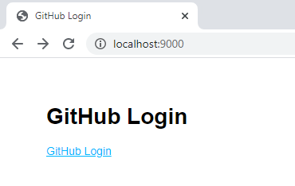
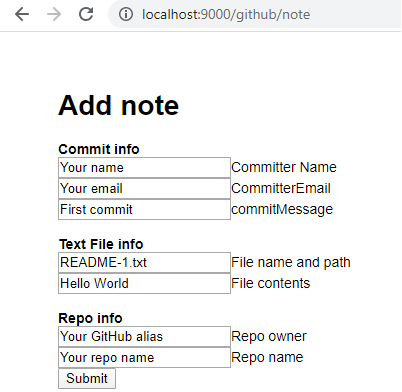

# GitHub oauth app

## OAuth Authentication flow

This is the flow for this demo. That doesn't mean it is the best flow, just that is what I choose for my flow. The browser only receives the session, the server has the authentication token and never shares it with the browser.

1. Server starts from `/bin/www` on port 9000.
1. Server (found in `app.js`) sends static `/public/index.html` to browser with GitHub login link.
    
1. User clicks on link.
1. Browser returns to server for `/login` route (found in `app.js`).
1. `/login` route redirects to `https://github.com/login/oauth/authorize?client_id=${CONFIG.GITHUB_CLIENT_ID}&scope=user%20repo` asking for scopes of user & repo.
1. Browser redirects to GitHub and displays a page for a user to review and accept your demo GitHub oauth app. All subsequent logins will not require that step and should happen automatically.
1. GitHub calls callback URL listed in oauth app, `http://localhost:9000/callback`.
1. Server's `/callback` route gets the code from the querystring returned from GitHub, and requests an authenticated token using an HTTP request via Axios:

    ```javascript
    return await axios({
        method: 'post',
        url: `https://github.com/login/oauth/access_token?client_id=${clientId}&client_secret=${clientSecret}&code=${code}`,
        headers: {
          accept: 'application/json'
        }

      });
    ```

    With the token, the same route gets the userProfile from GitHub using an HTTP request via Axios.

1. The token and user profile are set in the server session.
1. The request, still on the server, is redirected to `/github/note`.
1. A static form from `/public/note.html` is displayed in the browser to create a file on a repo you have permission to.

    

1. Enter the fields, making sure the file name is unique in the repo and submit the form to the server's route POST `/github/note`.
1. On the server, the file is committed on the default branch which is usually the master branch and the response from GitHub, including SHA is returned to the browser.

## How to use demo

1. Create [OAuth app](https://developer.github.com/apps/building-oauth-apps/creating-an-oauth-app/) on GitHub under your GitHub profile's **Developer settings**
1. Set the following for your oauth app:

    |Page|Setting|
    |--|--|
    |Homepage|`http://localhost:9000`|
    |Callback|`http://localhost:9000/callback`|

1. Copy `.env.sample` into `.env`
1. Set your GitHub OAuth app's **Client id** and **Client secret** in `.env`
1. Install dependencies with `npm install`.
1. Run server with `npm start`

## Use at your own risk

This **demo** server comes with some deployment caution - use at your own risk:
* no form validation
* not consistent with formatting such as single/double quotes, semi-colons, async/await versus callbacks
* very little error checking
* saves sessions to a file in the server directory
* uses console.log for logging
* use `[@octokit/rest]` for `github/readme` route, with querystring params, such as `http://localhost:9000/github/readme?repo=public-test&owner=diberry`

## Project references

* [GitHub Developer site](https://developer.github.com/)
* [GitHub Oauth v3 REST docs](https://developer.github.com/v3/)